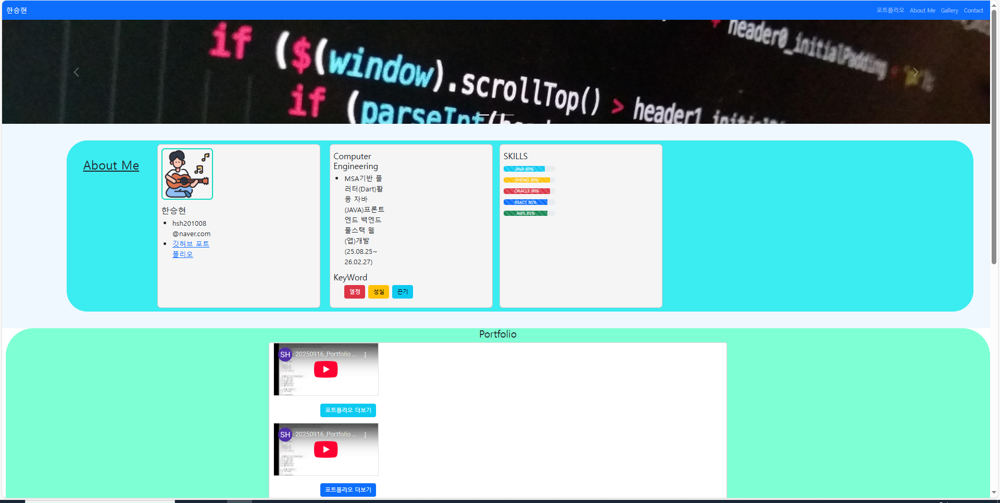
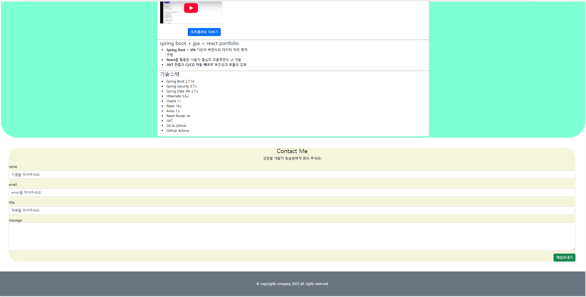

# ✨ ハン・スンヒョン  ポートフォリオ ✨
---
## 📌Contact  & Links 

|||
|-|-|
|名前（漢字|ハン・スンヒョン (韓承現)|
|メール|hsh201008@naver.com|
|Githubのアドレス|https://github.com/HSH703/Seunghyun_Portfolio.jp.git|
|ポートフォリオ|さまざまなプロジェクトを遂行し、単に機能を実装するレベルを超えて、問題を分析し改善点を導き出し、より良い成果物を生み出す過程で成長してきました。


---
- ###  主要技術スタック

|Backend 및 시스템 설계|Frontend 개발 역량|
|-|-|
|JAVA|React, JavaScript, JQuery|
|Spring Boot|API 비동기 통신|
|Oracle|배포 및 운영 환경|
|JPA + MyBatis|개발 환경 및 협업|
---


- ### 개인프로젝트





 |이름|주소|
 |-|-|
 |작업물|[개인프로젝트](http://127.0.0.1:5500/Seunghyun_Portfolio/Project/%EA%B0%9C%EC%9D%B8%ED%94%84%EB%A1%9C%EC%A0%9D%ED%8A%B8/docs/index.html)|

---

- ### 팀프로젝트(PAWJECT)

- #### 반려동물 건강&사료 종합 플랫폼 v4(React 전환 + JWT 인증)

- **실행화면**


<br/>
<br/>
<br/>

- **4차 프로젝트 관련 자료**

|항목|링크|
|-|-|
|포트폴리오(배포 URL)|[추후 추가예정]()|
|GitHub|[PAWJECT 4차](https://github.com/taehun00/thejoeun/tree/master/pawject4)|
|구글시트|[PAWJECT 4차 - Google Sheets](https://docs.google.com/spreadsheets/d/1tKH45UxPa-RrMnF8XNpTcCXr2Naq1IjctwE3coVSyS8/edit?pli=1&gid=0#gid=0)|
|YouTube|[촬영예정]()|

<br/>
<br/>
<br/>


- **담당 업무 및 성과**
  -  운동챌린지 게시판 구현 (React + Spring Boot)  
  - RESTful API 설계 및 신규 게시판 구축, SNS형 피드 UI/UX 개발 (Ant Design 활용)  
  → 성과: 사용자 체류 시간 및 챌린지 참여도 증가, 콘텐츠 탐색 효율 개선 
  - 댓글/대댓글 기능 개발 (JPA + MyBatis)  
  - 무한 댓글 구조 처리, 복잡한 계층형 쿼리 성능 최적화  
      → 성과: 데이터 처리 효율성 확보, 사용자 소통 활성화 
  - 체험단 게시판 및 광고 기능 구현  
  - Redis 캐싱 기반 광고 배너 노출 최적화, JWT 인증 기반 보안 강화  
  → 성과: 서버 응답 속도 개선, 유지보수성 향상, 신규 기능 개발 속도 가속화

<br/>
<br/>
<br/>

- **트러블슈팅**
```
- <사례1>  
    - 문제: 본인 작성 게시글과 리트윗 게시글을 동시에 페이징 조회 시 응답 지연 발생  
    - 원인: 서브쿼리·다중 조인 포함 복잡 로직을 JPA 기본 메서드로 처리 → 비효율적 쿼리 실행  
    - 해결: Native Query 작성, Oracle ROWNUM + 인라인 뷰 활용한 고급 페이징 로직 적용  
    - 추후 업그레이드 계획: Redis 캐싱 도입으로 반복 조회 시 DB 부하 최소화  
    - 성과: 대량 데이터 조회 속도 개선, 안정적 사용자 피드 제공  
    - 학습: SQL 튜닝과 Native Query 활용 역량 강화  
```
```
<사례2>  
    - 원인: DTO는 LocalDate 사용, 매핑 시 타입 핸들러 설정 미흡  
    - 해결: DTO 구조를 엔티티와 동기화, Jackson 라이브러리로 JSON 직렬화 시 날짜 포맷 통일  
    - 추후 업그레이드 계획: Global Response Wrapper 도입, API 응답 규격 표준화  
    - 성과: 데이터 전달 오류 제거, 화면 출력 정확성 확보  
    - 학습: 이기종 프레임워크 혼용 시 직렬화·타입 동기화 중요성 체득
```
<br/>
<br/>
<br/>

- **프로젝트 소감**
    - React와 Spring Boot를 연계한 풀스택 개발 과정에서 프론트엔드 상태 관리와 백엔드 데이터 
    처리 능력을 동시에 강화  
    - Oracle 11g 환경에서 JPA와 MyBatis를 병행 활용하며 기술적 제약을 극복하는 경험 확보  
    - JWT 인증·Redis 캐싱·광고 최적화 등 운영 가능한 서비스 구조를 직접 설계하며 보안·성능·확장성을 
    종합적으로 고려  
    - 팀 협업 과정에서 API 명세 정의·CI/CD 파이프라인 구축을 통해 실무형 협업 역량을 체득   
    
---

 - #### 반려동물 건강&사료 종합 플랫폼 v3(Spring Boot+Thymeleaf 고도화)
- **실행화면**


<br/>
<br/>
<br/>

- **3차 프로젝트 관련 자료**

|항목|링크|
|-|-|
|GitHub|[PAWJECT 3차](https://github.com/taehun00/thejoeun/tree/master/pawject3)|
|구글시트|[PAWJECT 3차 - Google Sheets](https://docs.google.com/spreadsheets/d/1qf483W3OjI8tLteDl4ohGsusr4az7OAgQ0jMewwhmjg/edit?gid=0#gid=0)|
|YouTube|[3차프로젝트_운동스마트게시판](https://www.youtube.com/watch?v=zX3kRQAQF2o)|


- **담당 업무 및 성과**
- 운동스마트게시판 구현  
  - 게시글 작성·수정·삭제 기능 개발, 사용자가 자유롭게 콘텐츠를 관리할 수 있도록 설계  
  - `MultipartFile` 기반 이미지 업로드 기능 구현, Ajax 활용으로 게시글 리스트 페이징 및 검색 기능 제공  
  → 성과: 사용자 편의성 강화, 직관적 UI와 안정적 데이터 처리 확보  
- 운동정보게시판 개발  
  - 운동 정보를 게시판 형태로 입력·조회 가능하도록 구현  
  - Ajax 기반 페이징 및 검색 기능 적용  
  → 성과: 사용자에게 참고 가능한 운동 정보 제공, 게시판 활용도 확대  
- 날씨추천게시판 구축  
  - 운동스마트게시판 작성 시 날씨 입력란과 연계, 단기예보 기반 날씨 추천 기능 구현  
  - Ajax 기반 페이징 및 검색 기능 적용  
  → 성과: 사용자 맞춤형 정보 제공, 실시간 데이터 활용 경험 확보  
- 산책코스추천게시판 개발  
  - 하버사인(Haversine) 계산법 적용, 현재 위치 기준 가까운 산책코스 거리 계산 기능 구현  
  - Ajax 기반 페이징 및 검색 기능 적용  
   → 성과: 위치 기반 추천 서비스 제공, 알고리즘 적용 역량 강화  
- DB 관리 및 최적화  
  - Oracle DB 기반 데이터 관리, `ROWNUM`과 `SEARCH` 활용한 페이징·검색 기능 구현  
  - Spring Boot + Ajax 연계로 서버-클라이언트 간 데이터 흐름 안정화  
 → 성과: 대량 데이터 환경에서도 안정적 조회·검색 기능 확보

<br/>
<br/>
<br/>

- **트러블슈팅**
```
- <사례1>  
    - 문제: 산책 추천 기능에서 현재 위치가 잘못 지정되는 오류 발생  
    - 원인: 하버사인 계산법 적용 구문에서 함수명이 현재 위치와 관련된 함수명으로 올바르게 입력되지 않음  
    - 해결: 함수명을 수정하고 정상 작동 여부 검증, 위치 기반 추천 기능 안정화  
    - 성과: 하버사인 계산법 이해도 향상, 위치 기반 API 적용 자신감 확보  
    - 학습: 알고리즘 적용과 위치 데이터 처리의 중요성 체득  
    - 향후 개선 계획: GPS API와 연동해 실시간 위치 기반 추천 기능 고도화 예정  
```
```
<사례2>  
    - 문제: Ajax 기반 페이징 처리 시 검색 조건이 유지되지 않아, 페이지 이동 시 전체 데이터가 출력되는 오류 발생  
    - 원인: 검색 파라미터 전달 로직이 페이징 요청과 분리되어 있어 조건이 누락됨  
    - 해결: Ajax 요청 시 검색 조건을 함께 전달하도록 로직 수정, 서버에서 조건 기반 페이징 처리 강화  
    - 성과: 검색 결과 내 페이징 유지, 사용자 경험 개선  
    - 학습: 클라이언트-서버 간 파라미터 전달 구조 설계 역량 강화  
    - 향후 개선 계획: ElasticSearch 기반 검색 엔진 도입 검토, 대규모 데이터 환경에서도 검색 성능
    최적화 예정
```
<br/>
<br/>
<br/>

- **프로젝트 소감**
    - 새로운 기술을 적용하면서 이전 작업의 개선점을 반영해 서비스 완성도를 높이는 경험 확보  
    - 하버사인 계산법·Ajax·Oracle DB 최적화 등 다양한 기술을  적용, 문제 해결 능력과 응용력 강화  
    - 이번 프로젝트를 통해 위치 기반 추천·실시간 데이터 처리·검색 최적화 등 확장성 있는 기능 구현 역량 
---

 - #### 반려동물 건강&사료 종합 플랫폼 v2 (Spring+MyBatis 구조화)
- **실행화면**


<br/>
<br/>
<br/>

- **2차 프로젝트 관련 자료**

|항목|링크|
|-|-|
|GitHub|[PAWJECT 2차](https://github.com/taehun00/thejoeun/tree/master/pawject2)|
|피그마|[PAWJECT 2차 - Figma](https://www.figma.com/deck/j626h6S3cxnQN7z0ZsQCNT/PAWJECT_ver2?node-id=1-261)|
|YouTube|[2차프로젝트_운동챌린지게시판](https://www.youtube.com/watch?v=eN79WDRs4wI)|


- **담당 업무 및 성과**
- 운동챌린지게시판 구현  
  - 게시글 작성·수정·삭제 기능 개발, 사용자가 자유롭게 콘텐츠를 관리할 수 있도록 설계  
  - `MultipartFile` 기반 이미지 업로드 기능 구현, Ajax 활용으로 게시글 리스트 페이징 및 검색 기능 
  → 성과: 사용자 편의성 강화, 직관적 UI와 안정적 데이터 처리 확보  
- 운동정보게시판 개발  
  - 운동 정보를 게시판 형태로 입력·조회 가능하도록 구현  
  - 운동챌린지게시판 작성 시 참고할 수 있는 구조 설계  
  → 성과: 사용자에게 참고 가능한 운동 정보 제공, 게시판 활용도 확대  
- DB 관리 및 최적화  
  - Oracle DB 기반 데이터 관리, `ROWNUM`과 `SEARCH` 활용한 페이징·검색 기능 구현  
  - Spring Boot + Ajax 연계로 서버-클라이언트 간 데이터 흐름 안정화  
  → 성과: 대량 데이터 환경에서도 안정적 조회·검색 기능 확보

<br/>
<br/>
<br/>

- **트러블슈팅**
```
- <사례1>  
    - 문제: 게시글 상세보기에서 데이터를 제대로 받아오지 못해 상세 페이지 확인 불가  
    - 원인: View 단에서 `${}` 구문 누락 및 DTO 컬럼 불일치로 데이터 바인딩 실패  
    - 해결: 누락된 구문을 추가하고 DTO 컬럼을 일치시켜 정상 작동 확인  
    - 성과: Spring 화면 연동 시 필수 구문 사용법 습득, 데이터 바인딩 로직 이해도 향상  
    - 학습: View-DTO 간 데이터 매핑 중요성 체득  
    - 향후 개선 계획: DTO와 Entity 간 매핑 자동화를 위해 ModelMapper 도입 검토  
```
```
<사례2>  
    - 문제: Ajax 기반 페이징 처리 시 검색 조건이 유지되지 않아 페이지 이동 시 전체 데이터 출력  
    - 원인: 검색 파라미터 전달 로직이 페이징 요청과 분리되어 조건 누락 발생  
    - 해결: Ajax 요청 시 검색 조건을 함께 전달하도록 로직 수정, 서버에서 조건 기반 페이징 처리 강화  
    - 성과: 검색 결과 내 페이징 유지, 사용자 경험 개선  
    - 학습: 클라이언트-서버 간 파라미터 전달 구조 설계 역량 강화  
    - 향후 개선 계획: ElasticSearch 기반 검색 엔진 검토, 대규모 데이터 환경에서도 검색 성능 최적화 예정
```
<br/>
<br/>
<br/>

- **프로젝트 소감**
    - 설계를 시각화하는 과정의 중요성과 프로젝트 전체 흐름을 파악하는 능력을 키움  
    - 코드 입력보다 기능적 이해와 구조적 설계에 집중하며 서비스 완성도와 유지보수성을 높임  
    - Spring Security·Ajax·Oracle DB 등 다양한 기술을 적용하며 데이터 흐름·보안·검색 최적화 경험 확보  
    - 부족한 점은 있었지만, 프로젝트를 통해 분명한 성장과 확장 가능성을 체감

---

 - #### 반려동물 건강&사료 종합 플랫폼 v1 (JSP 기반 프로토타입)
- **실행화면**
    


<br/>
<br/>
<br/>

- **1차 프로젝트 관련 자료**


|항목|링크|
|-|-|
|GitHub|[PAWJECT 1차](https://github.com/taehun00/thejoeun/tree/master/pawject1)|

- **담당 업무 및 성과**
    -	반려동물 맞춤형 운동 정보 관리 시스템(CRUD) 구축
    -	MVC2 패턴(Model-View-Controller)을 적용하여 운동 정보의 등록, 전체 조회, 상세 보기, 수정, 삭제 프로세스 설계 및 구현.
    -	`Execinfo_Controller`를 통한 요청 분기 및 `ExecinfoService` 인터페이스 기반의 서비스 객체화로 유지보수가 용이한 비즈니스 로직 설계.
    -	Oracle DB 연동을 위한 DAO(Data Access Object) 클래스 설계 및 JDBC를 활용한 안정적인 데이터 처리 로직 구축.
    -	성과: 핵심 게시판 기능의 안정적 구현을 통해 차후 확장(버전 v2~v4)을 위한 표준화된 데이터 흐름 기반 마련 및 서비스 운영 효율성 증대.

<br/>
<br/>
<br/>

- **트러블슈팅**
```
- <사례1>  
    - 문제: 컨트롤러에 비즈니스 로직이 집중되어 코드 비대화 및 가독성 저하 발생
    - 원인: 요청 처리와 DB 로직을 컨트롤러가 함께 담당하는 구조
    - 해결: ExeExecinfoService 인터페이스를 정의하고 기능별(Insert, List, Detail, Update, Delete) 클래스로 로직 분리
    - 추후 업그레이드 계획: 추상 클래스 도입 또는 Spring @Service 기반 구조로 개선 예정
    - 성과: 컨트롤러는 경로 제어에 집중하게 되어 가독성 및 유지보수성 향상
    - 학습: 단일 책임 원칙(SRP)의 중요성을 실무를 통해 이해
```
```
<사례2>  
    - 문제: 데이터 처리 후 사용자에게 성공 여부 전달이 불명확함
    - 원인: 단순 Forward 방식으로 DB 처리 결과 전달에 한계 존재
    - 해결: request.setAttribute()로 결과 전달 후 JavaScript alert 및 페이지 이동 처리
    - 추후 업그레이드 계획: AJAX 기반 비동기 통신으로 UX 개선 예정
    - 성과: 사용자에게 명확한 피드백 제공으로 서비스 신뢰도 향상
    - 학습: 백엔드 처리 결과와 프론트엔드 UX 간의 연계 중요성 인식
```
<br/>
<br/>
<br/>

- **프로젝트 소감**
    - 설계 시각화를 통해 전체 시스템 흐름 이해 능력 향상
    - 기능 구현보다 구조 중심 설계로 완성도와 유지보수성 강화
    - Spring Security, Ajax, Oracle DB 적용을 통해 데이터 흐름·보안·검색 처리 경험 축적
    - 미흡한 부분도 있었으나 프로젝트 전반을 통해 성장과 기술 확장 가능성 체감

---