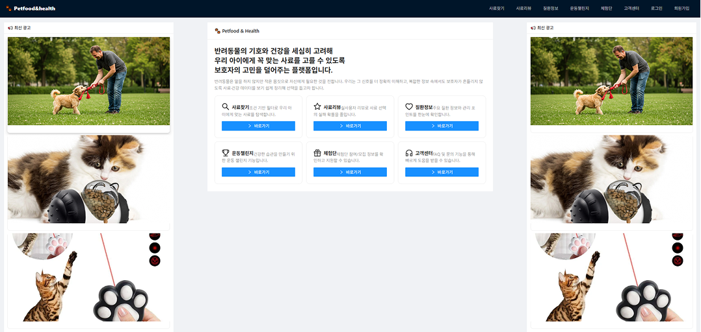
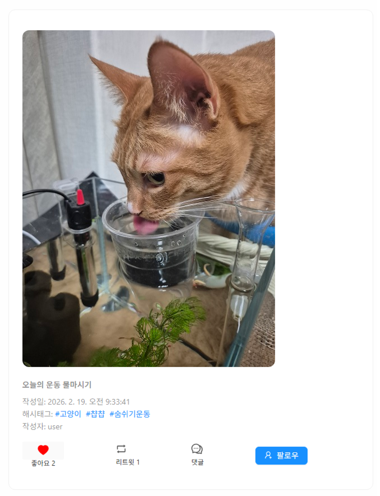
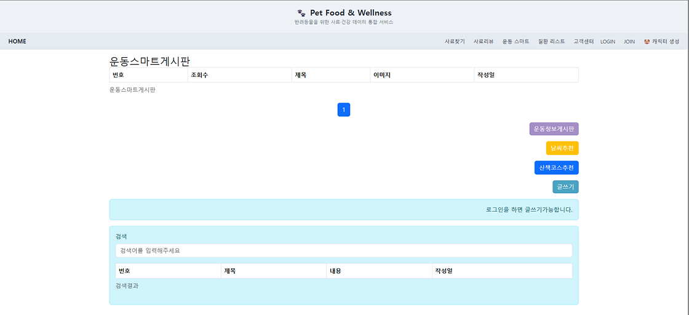
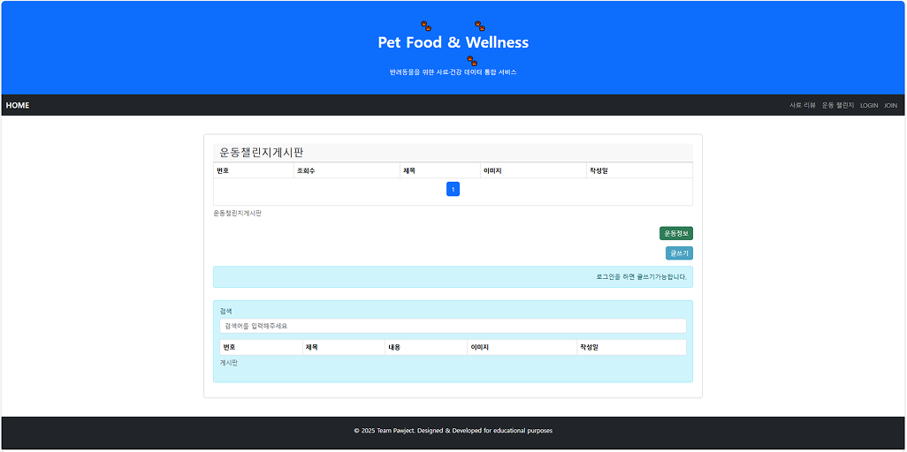
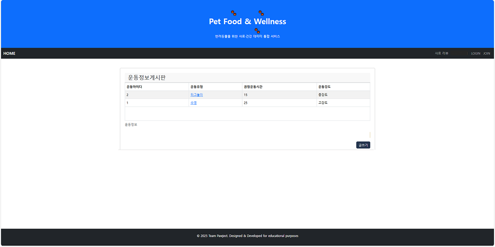
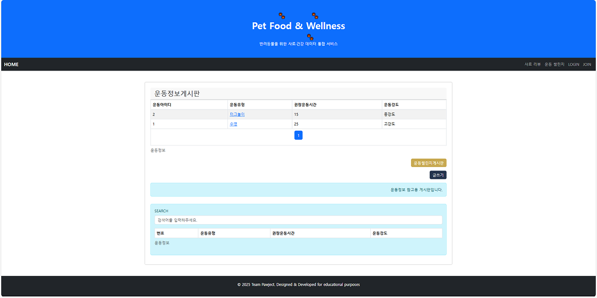

# ✨ ハン・スンヒョン  ポートフォリオ ✨
---
## 📌Contact  & Links 

|||
|-|-|
|名前（漢字|ハン・スンヒョン (韓承現)|
|メール|hsh201008@naver.com|
|Githubのアドレス|https://github.com/HSH703/Seunghyun_Portfolio.jp.git|
|ポートフォリオ|さまざまなプロジェクトを遂行し、単に機能を実装するレベルを超えて、問題を分析し改善点を導き出し、より良い成果物を生み出す過程で成長してきました。


---
- ###  主要技術スタック

|バックエンドおよびシステム設計| フロントエンド開発力量|DataBase|Communication/ Integration|Communication Tools|Deployment/Server Environment|
|-|-|-|-|-|-|
|☕ Java 11 / Java 17 (JDK 11 / JDK 17)|🧩 HTML5 / CSS3     |🛢️Oracle Database 11g XE (11.2.0.2.0)|🔄 AJAX (jQuery 3.7 기반)|🐙 Git 2.51/ GitHub|🖼️ Multipart File Upload (Spring Boot / Spring MVC 4.3) |
|🗂️ MyBatis 3.5 / 2.3 / 3.0            |⚡ JavaScript (ES11)|📦 Redis|📄 JSON|🎨 Figma|🚀 Apache Tomcat 9.0.111 / 9 (Embedded)|
|🌱 Spring Framework 4.3 / 2.7 (MVC, Security)|🌀 jQuery 3.7||🔌 External API||☁️ AWS|
|🌱 Spring Boot 3.4|🟦 Bootstrap 5||🔐 JWT 인증|||
|🧬JPA|🎛️ Ant Design|||||

---

- ### チームプロジェクト(PAWJECT)
#### 🧱 VersionRoadMap (v1~v4)
| Version | 核心目標 |主要機能|
|---|---|---|
| v4 | ユーザー中心のUI/UX改編により、コンテンツの探索効率と参加度を高め、競争力を強化 |Reactの切り替え + JWT/Redis/CI-CDの適用で運用型アーキテクチャを完成| 
| v3 |カスタマーセンター、飼料検索、レビュー、運動、健康情報などの主要機能を追加し、総合サービスに拡張 | | 外部API連携＋カスタマーサポート／検索／運用拡張で総合プラットフォーム化 | 
| v2 | 初期バージョン（v1）をSpring Frameworkベースに拡張し、核心掲示板機能を高度化   | 検索/ページング/AJAX/アップロードに基づく実用サービス化 | 
| v1 | メンバー・飼料・健康・レビュー・運動機能を実装し、サービス形態を具体化する | JSP/ServletベースのMVC2構造で掲示板プロトタイプを実装 | 
---

- #### ペットの健康＆フード総合プラットフォーム v4（React切り替え＋JWT認証）

- **実行画面 - 広告バナー**
<p align="left">
  
</p>

- **担当業務および成果**
- 体験団掲示板および広告機能の具現 
    - Redisキャッシュにベースの広告バナーの表示最適化、JWT認証に基づくセキュリティ強化。
         - 成果：サーバー応答速度の改善、保守性の向上、新機能開発のスピード加速。


---

- **実行画面 - SNSベースの運動チャレンジ掲示板**
<p align="left">

</p>

- **担当業務および成果**
- 運動チャレンジ掲示板の具現. (React + Spring Boot)  
  - RESTful APIの設計と新しい掲示板の構築, SNS型フィードのUI/UX開発（Ant Design活用）  
    - 成果：ユーザーの利用時間とチャレンジ参加度の増加、コンテンツ探索の効率改善。
  - コメント/返信機能の開発 (JPA + MyBatis)  
  - 無限コメント構造の処理、複雑な階層型クエリの性能最適化  
    - 成果：データ処理の効率性確保、ユーザーとのコミュニケーション活性化 


---

- **第4次プロジェクト関連資料**
    |項目|リンク|
    |-|-|
    |ポートフォリオ(配布 URL)|[PAWJECT 第4回 – 配布URL](http://54.180.94.156)|
    |GitHub|[PAWJECT 第4回 – TeamProject Github](https://github.com/taehun00/thejoeun/tree/master/pawject4)|
    |Figma|[PAWJECT 第4回 – Figma](https://www.figma.com/deck/p5XSa4gGr7FLTs0VTKnDgF/PAWJECT_ver4?node-id=1-261&t=Ze7c2GsPzUcjjIdV-0&scaling=min-zoom&content-scaling=fixed&page-id=0%3A1)|
    |YouTube(自分のパート)|[第4回 プロジェクト – 広告バナー](https://www.youtube.com/watch?v=L5Sabniz1DY)|


<details>
  <summary> 第4次プロジェクトの詳細を見る。</summary>

---

- **プロジェクトの目標**
- Reactベースのフロント/バック分離アーキテクチャへの切り替え → サービスの拡張と保守性の確保
- API中心の構造再編により、機能間の連携性を強化し、新機能の開発スピードを向上させる。
- JWT認証とRedisキャッシングの適用により、セキュリティとパフォーマンスを同時に確保 → 安定したサービス運営基盤
- ユーザー中心のUI/UXの改編 → コンテンツ探索の効率性と参加度を高め、プラットフォームの競争力を強化

---
 
- **主要機能（本人パート：体験団掲示板（広告バナー）／SNSベースの運動チャレンジ掲示板）** 
- Reactの移行 - 既存の掲示板UIをReactベースで再構成し、共通UI（ヘッダー/ナビゲーション）とメインページをリニューアル 
-  認証/セキュリティ（JWT） - Spring Securityベースの認証構造をJWTトークン方式に移行 → API中心のログイン/認可システムを構築  
-  新規/拡張機能 - 体験団掲示板、疾病情報掲示板、SNSベースの運動チャレンジ掲示板などの新機能開発および既存データ構造の改編  
---

トラブルシューティング
```
<事例1> 
- 問題：自分が書いた投稿とリツイート投稿を同時にページングで閲覧すると、応答が遅延する  
- 原因:サブクエリや複数の結合を含む複雑なロジックをJPAの基本メソッドで処理 → 非効率的なクエリ実行  
- 解決: Native Queryの作成、Oracle ROWNUM + インラインビューを活用した高度なページングロジックの適用  
- 今後のアップグレード計画：Redisキャッシングの導入により、繰り返し照会時のDB負荷を最小化  
- 成果: 大量データの照会速度改善、安定したユーザーフィードの提供  
- 学習：SQLチューニングとネイティブクエリ活用力量の強化
```
```
<事例2>  
- 問題: JPA LocalDateTimeとフロントエンド・MyBatis DTO間の日数形式の不一致  
- 原因: DTOはLocalDateを使用し、マッピング時にタイプハンドラーの設定が不十分  
- 解決: DTO構造をエンティティと同期し、JacksonライブラリでJSONシリアライズする際に日付フォーマットを統一  
- 今後のアップグレード計画：Global Response Wrapperの導入、API応答規格の標準化  
- 成果：データ伝達エラーの除去、画面出力の正確性確保  
- 学習: 異種フレームワークの混用時にシリアル化・タイプ同期の重要性を体得
```    
 
---

- **プロジェクトの感想**
- ReactとSpring Bootを連携させたフルスタック開発プロセスにおけるフロントエンドの状態管理とバックエンドデータ 
処理能力を同時に強化  
- Oracle 11g環境でJPAとMyBatisを併用し、技術的制約を克服する経験を確保  
- JWT認証・Redisキャッシング・広告最適化など 運用可能なサービス構造を直接設計し、セキュリティ・性能・拡張性を 
総合的に考慮  
- チーム協力の過程でAPI仕様の定義やCI/CDパイプラインの構築を通じて実務型の協力能力を身につける
        

</details>

---

- #### ペットの健康＆餌総合プラットフォーム v3 (Spring Boot+Thymeleafの高度化)
- **実行画面 - 運動スマート掲示板**



- **メイン担当業務および成果**
- 運動スマート掲示板の実装  
  - 投稿の作成・修正・削除機能を開発し、ユーザーが自由にコンテンツを管理できるように設計  
  - `MultipartFile`ベースのイメージアップロード機能の実装、Ajaxを活用した投稿リストのページングおよび検索機能の提供  
    - 成果: ユーザーの利便性向上、直感的なUIと安定したデータ処理の確保


---
- **第3次プロジェクト関連資料**

|項目|リンク|
|-|-|
|GitHub|[PAWJECT 第3 回 – TeamProject Github](https://github.com/taehun00/thejoeun/tree/master/pawject3)|
|Figma|[PAWJECT 第3 回 - Figma](https://www.figma.com/deck/agVQ2UET3VDuGyPsoOOyh6/PAWJECT_ver3?node-id=1-261&t=vW2UAcWi4Fd8xILs-0&scaling=min-zoom&content-scaling=fixed&page-id=0%3A1)|
|YouTube(自分のパート)|[第3プロジェクト – 運動スマート掲示板](https://www.youtube.com/watch?v=zX3kRQAQF2o)|


<details>
  <summary> 第3次プロジェクトの詳細を見る。</summary>

---

- **プロジェクトの目標**
- 既存のv2サービスをSpring Bootベースに拡張 → 本格的な運用が可能なサービス構造へと発展  
- 外部API連携（OCR、ChatGPT、Channel Talk、天気/地図APIなど） → ユーザーの利便性と 
サービスの完成度を高度化  
- カスタマーセンター・資料検索・レビュー・運動・健康情報掲示板などの主要機能を追加し、プラットフォームを 
総合サービスへ拡大  
- UI/UXの改善とデータフローの最適化により、ユーザーの動線とコンテンツのアクセス性を強化
---
- **詳細な担当業務と成果**  
- 運動情報掲示板の開発  
  - 運動情報を掲示板形式で入力・照会できるように具現  
  - Ajaxベースのページングおよび検索機能を適用  
    - 成果：ユーザーに参考になる運動情報を提供し、掲示板の活用度を拡大  
- 天気おすすめ掲示板の構築  
  - 運動スマート掲示板作成時に天気入力欄と連携し、短期予報に基づく天気推薦機能を具現  
  - Ajaxベースのページングおよび検索機能を適用  
    - 成果：ユーザーに合わせた情報提供、リアルタイムデータ活用の経験を確保  
- 散歩コース推薦掲示板の開発  
  - ハーバーサイン（Haversine）計算法を適用し、現在位置を基準に近い散歩コースの距離を計算する機能を具現  
  - Ajaxベースのページングおよび検索機能を適用  
    - 成果: 位置情報に基づく推薦サービスの提供、アルゴリズム適用能力の強化  
- DB管理と最適化  
  - Oracle DBを基にしたデータ管理、`ROWNUM`と`SEARCH`を活用したページング・検索機能の具現  
  - Spring Boot + Ajax連携でサーバー-クライアント間のデータフローを安定化  
    - 成果: 大量データ環境でも安定した照会・検索機能を確保
---

- **主な機能（自分のパート：運動掲示板）**
    - メンバー管理 – 会員/ペット情報管理、WebSocketベースの通知機能 
    - 飼料掲示板（管理者） - 飼料データの登録・修正・削除、OCRベースの自動入力 
    - レビュー掲示板 - レビューの作成/閲覧、複数画像の添付、ChatGPTに基づくレビュー文の簡素化 
    - フード検索機能 - 条件に基づく詳細フィルター検索、検索結果→レビュー連携、ChatGPTベースのフィルター推薦 
    - カスタマーサポート – FAQ機能、1対1問い合わせ、Channel Talk APIベースのリアルタイム相談連携 
    - 運動掲示板 – 天気/地図APIに基づく情報提供、運動情報掲示板 ↔ 運動スマート掲示板連携 
    - 健康情報掲示板 – 健康情報データの提供および管理機能 
    - イベント - AIベースのペットキャラクター生成機能

---


- **トラブルシューティング**
```
- <事例1>  
    - 問題: 散歩推薦機能で現在位置が誤って指定されるエラーが発生  
    - 原因: ハーバーサイン計算法適用文で関数名が現在位置に関連する関数名として正しく入力されていない  
    - 解決: 関数名を修正し、正常動作の検証、位置情報に基づく推薦機能の安定化  
    - 成果: ハーバーサインの計算方法の理解度向上、位置情報ベースのAPI適用に対する自信の確保  
    - 学習：アルゴリズムの適用と位置データ処理の重要性を体得  
    - 今後の改善計画：GPS APIと連携し、リアルタイム位置情報に基づく推薦機能の高度化を予定
```
```
<事例2>  
    - 問題: Ajaxベースのページング処理時に検索条件が維持されず、ページ移動時に全データが出力されるエラーが発生  
    - 原因: 検索パラメータの伝達ロジックがページングリクエストと分離されているため、条件が欠落している  
    - 解決: Ajaxリクエスト時に検索条件を一緒に渡すようにロジックを修正し、サーバーで条件ベースのページング処理を強化  
    - 成果：検索結果内のページング維持、ユーザー体験の改善  
    - 学習：クライアント-サーバー間のパラメータ伝達構造設計力量の強化  
    - 今後の改善計画：ElasticSearchベースの検索エンジン導入の検討、大規模データ環境でも検索性能最適化予定
```
---

- **プロジェクトの感想**
    - 新しい技術を適用し、以前の作業の改善点を反映してサービスの完成度を高める経験を確保  
    - ハーバーサイン計算法、Ajax、Oracle DB最適化などのさまざまな技術を適用し、問題解決能力と応用力を強化  
    - 今回のプロジェクトを通じて、位置情報に基づく推薦、リアルタイムデータ処理、検索最適化などの拡張性のある機能を実現する力量

</details>

---

- #### ペット健康＆フード総合プラットフォーム v2 (Spring+MyBatis 構造化)
- **実行画面 - 運動チャレンジ掲示板**
<p align="left">

</p>


- **メイン担当業務および成果**
- 運動チャレンジ掲示板の実装  
  - 投稿の作成・修正・削除機能を開発し、ユーザーが自由にコンテンツを管理できるように設計  
  - `MultipartFile`に基づく画像アップロード機能の実装、Ajaxを活用した投稿リストのページングおよび検索機能 
    - 成果: ユーザーの利便性向上、直感的なUIと安定したデータ処理の確保

---


- **実行画面 - 運動情報掲示板 プロジェクトバージョン比較 (v1 → v2)**

| Before (v1) |  | After (v2) |
|-------------|----|------------|
|  |➡️|  |

- **担当業務および成果**
- 運動情報掲示板 v2 開発  
  - 運動情報を掲示板形式で入力・照会できるように具現  
  - 運動チャレンジ掲示板作成時に参考にできる構造設計  
    - 成果：ユーザーに参考になる運動情報を提供し、掲示板の活用度を拡大


<details>
  <summary> プロジェクトバージョンの詳細比較。</summary>

---

- **v1 & v2 比較.**

| 区分 | Before (v1) | After (v2) |
|------|-------------|------------|
| 主な機能 | ペット向けカスタマイズ運動情報管理システム（CRUD） | 運動情報掲示板の開発 |
| 設計パターン | MVC2パターンの適用 | 掲示板構造設計 |
| データ処理 | Oracle DB連携DAO + JDBC | 掲示板入力・照会機能の実装 |
| ビジネスロジック | `Execinfo_Controller` リクエスト分岐 + `ExecinfoService` インターフェースベースのサービスオブジェクト化 | 運動チャレンジ掲示板作成時の参考可能構造 |
| 成果 | 安定したCRUDの実装 → 今後の拡張（v2~v4）基盤の整備 | ユーザーに参考となる運動情報を提供し、掲示板の活用度を拡大 |

</details>

---

- **変化の要約**
- **Before (v1)** → 核心的なCRUD機能を中心に、安定したデータフローの基盤を整備  
- **After (v2)** → ユーザーフレンドリーな掲示板機能の拡張、活用度およびサービス価値の向上

---

- **第2次プロジェクト関連資料**

|項目|リンク|
|-|-|
|GitHub|[PAWJECT 第2 回 – TeamProject Github](https://github.com/taehun00/thejoeun/tree/master/pawject2)|
|Figma|[PAWJECT 第2 回 - Figma](https://www.figma.com/deck/j626h6S3cxnQN7z0ZsQCNT/PAWJECT_ver2?node-id=1-261)|
|YouTube(自分のパート)|[第2プロジェクト_運動チャレンジ掲示板](https://www.youtube.com/watch?v=eN79WDRs4wI)|

<details>
  <summary>第2次プロジェクトの詳細を見る。</summary>

---

- **プロジェクトの目標**
- 初期バージョン（v1）をSpring Frameworkベースに拡張 → 核心掲示板機能を高度化  
- 検索·ページング·複数画像アップロード·AJAX運用機能を追加 → 実際に利用できるサービス形態へ改善  
- データ構造とUIの一貫性を強化し、ユーザー体験と運営効率を同時に確保  
- 法的リスクを考慮したデータ/画像処理システムを整備 → 安定したサービス運営基盤の確保

---

- **主要機能（自分のパート：運動情報掲示板 v2）**
- メンバー管理 – 会員登録/ログイン/退会/情報修正、ペット情報管理、会員検索、ページング  
- フード掲示板（管理者） – フードデータのCRUD、迅速な削除機能、検索、ページング  
- 健康情報掲示板 – 健康情報のCRUD、検索、ページング  
- レビュー掲示板 – レビューのCRUD、検索、ページング、複数画像の添付  
- 運動情報掲示板 v2 – 運動情報のCRUD、検索、ページング

---

- **詳細な担当業務と成果**
- DB管理と最適化  
  - Oracle DBを基にしたデータ管理、`ROWNUM`と`SEARCH`を活用したページング・検索機能の実装  
  - Spring Boot + Ajax連携でサーバー-クライアント間のデータフローを安定化  
    - 成果: 大量データ環境でも安定した照会・検索機能を確保
    
---

- **トラブルシューティング**
```
- <事例1>  
    - 問題：投稿の詳細表示でデータを正しく取得できず、詳細ページが確認できない  
    - 原因: View側で `${}` 構文の欠落とDTOカラムの不一致によりデータバインディングに失敗  
    - 解決: 欠落した構文を追加し、DTOカラムを一致させて正常に動作することを確認  
    - 成果: Spring画面連携時の必須文の使い方を習得し、データバインディングロジックの理解度を向上  
    - 学習: View-DTO間のデータマッピングの重要性を体得  
    - 今後の改善計画：DTOとEntity間のマッピング自動化のためにModelMapperの導入を検討
```
```
<事例2>  
    - 問題: Ajaxベースのページング処理時に検索条件が維持されず、ページ移動時に全データが出力される  
    - 原因: 検索パラメータの伝達ロジックがページングリクエストと分離されて条件の欠落が発生  
    - 解決: Ajaxリクエスト時に検索条件を一緒に渡すようにロジックを修正し、サーバーで条件ベースのページング処理を強化  
    - 成果：検索結果内のページング維持、ユーザー体験の改善  
    - 学習：クライアント-サーバー間のパラメータ伝達構造設計能力の強化  
    - 今後の改善計画：ElasticSearchベースの検索エンジンの見直し、大規模データ環境でも検索性能の最適化を予定
```

---

- **プロジェクトの感想**
- 設計を視覚化するプロセスの重要性とプロジェクト全体の流れを把握する能力を向上させる 
- コード入力よりも機能的理解と構造的設計に集中し、サービスの完成度と保守性を高める  
- Spring Security、Ajax、Oracle DBなどのさまざまな技術を適用し、データの流れ、セキュリティ、検索の最適化経験を確保  
- 不足している点はあったが、プロジェクトを通じて明確な成長と拡張の可能性を実感

</details>

---


- #### ペット健康＆フード総合プラットフォーム v1 (JSPベースのプロトタイプ)
- **実行画面 - 運動情報掲示板 v1**


- **担当業務および成果**
    - ペット向けカスタマイズ運動情報管理システム（CRUD）の構築
    - MVC2パターン（Model-View-Controller）を適用して、運動情報の登録、全体の照会、詳細表示、修正、削除プロセスの設計と実装。
    - `Execinfo_Controller`を通じたリクエスト分岐と`ExecinfoService`インターフェースに基づくサービスオブジェクト化により、メンテナンスが容易なビジネスロジックを設計。
    - Oracle DB連携のためのDAO（Data Access Object）クラス設計とJDBCを活用した安定したデータ処理ロジックの構築。
        - 成果: コア掲示板機能の安定した実装を通じて、今後の拡張（バージョンv2〜v4）に向けた標準化されたデータフロー基盤を整備し、サービス運営の効率性を向上。

---

- **第1次プロジェクト関連資料**

|項目|リンク|
|-|-|
|GitHub|[PAWJECT 第1回 – TeamProject Github](https://github.com/taehun00/thejoeun/tree/master/pawject1)|

<details>
  <summary> 第1次プロジェクトの詳細を見る。</summary>

---

- **プロジェクトの目標**
- JSP/ServletベースのMVC2構造/掲示板プロトタイプを具現 → サービスアイデアを実際の画面とデータフローで具体化  
- コア掲示板機能（CRUD）を中心に → メンバー·資料·健康·レビュー·運動情報管理機能を設計·具現  
- UI/データ構造設計の経験 → その後のバージョン（v2~v4）拡張に必要な基盤を整える

---

- **主要機能（自分のパート：運動情報掲示板）**
- メンバー管理 – 会員登録/ログイン/退会/情報修正  
- 資料掲示板 – 資料データの登録/照会/修正/削除  
- 健康情報掲示板 – ペットの健康情報の登録/照会/修正/削除  
- レビュー掲示板 – ユーザーレビューの登録/閲覧/修正/削除  
- 運動情報掲示板 – ペットの運動情報の登録/照会/修正/削除

---

- **トラブルシューティング**
```
<事例1>  
    - 問題: コントローラーにビジネスロジックが集中し、コードの肥大化と可読性の低下が発生
    - 原因: リクエスト処理とDBロジックをコントローラーが共同で担当する構造
    - 解決: ExecinfoServiceインターフェースを定義し、機能別（Insert、List、Detail、Update、Delete）クラスにロジックを分離
    - 今後のアップグレード計画：抽象クラスの導入またはSpring @Serviceベースの構造に改善予定
    - 成果: コントローラーは経路制御に集中し、可読性と保守性が向上
    - 学習：単一責任原則（SRP）の重要性を実務を通じて理解する
```
```
<事例2>  
    - 問題: データ処理後、ユーザーに成功の有無が不明確である
    - 原因: 単純なフォワード方式でDB処理結果の伝達に限界が存在
    - 解決: request.setAttribute()で結果を渡した後、JavaScriptのalertおよびページ移動処理
    - 今後のアップグレード計画：AJAXベースの非同期通信でUXを改善予定
    - 成果：ユーザーに明確なフィードバックを提供し、サービスの信頼性を向上
    - 学習：バックエンド処理結果とフロントエンドUXの連携の重要性を認識
```

---

- **プロジェクトの感想**
- 設計の視覚化を通じて全体システムの流れを理解する能力を向上
- 機能実装よりも構造中心の設計で完成度と保守性を強化
- Spring Security、Ajax、Oracle DBの適用を通じてデータの流れ・セキュリティ・検索処理の経験を蓄積
- 不十分な部分もあったが、プロジェクト全体を通じて成長と技術拡張の可能性を実感

</details>

---

- **プロジェクト設計概要 - 参考として（ハン・スンヒョン-要求事項定義書）をご参照ください。**

|項目|GoogleシートのURL|
|-|-|
|第4 次プロジェクト|[PAWJECT 第4回-Google Sheets](https://docs.google.com/spreadsheets/d/1tKH45UxPa-RrMnF8XNpTcCXr2Naq1IjctwE3coVSyS8/edit?pli=1&gid=0#gid=0)|
|第3 次プロジェクト|[PAWJECT 第3回-Google Sheets](https://docs.google.com/spreadsheets/d/1qf483W3OjI8tLteDl4ohGsusr4az7OAgQ0jMewwhmjg/edit?gid=0#gid=0)|

---